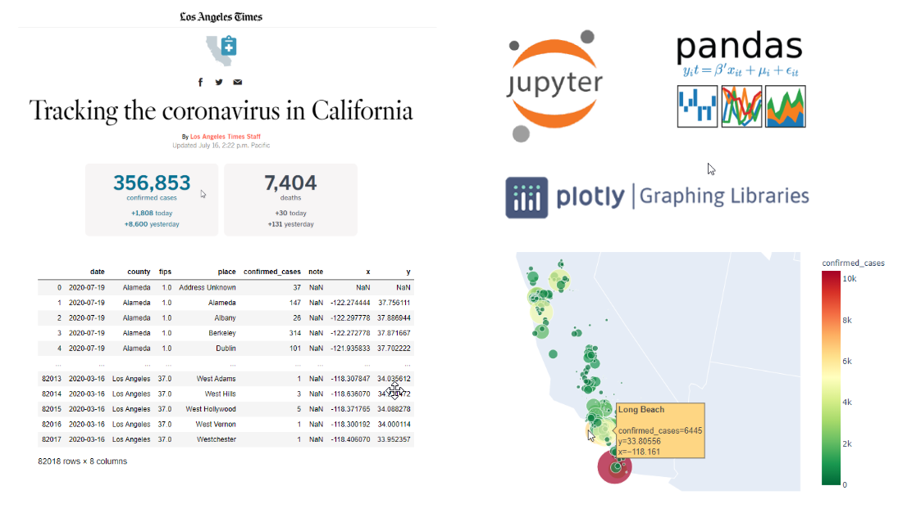

# Introduction to GIS/Spatial Research with Python

As members of an academic community with a myriad of research initiatives, the need to map information, to spatially analyze, to geoprocess, and to visualize space and time is becoming ubiquitous. But how do you get started? The answer to this question largely depends on what you want to map, and how you want to create your map. The what is usually easy. It is driven by your passion to pursue a research question and to have maps assist in the development of an argument. The how is the difficult part. It may depend on what data you have, what tools you have access to, how comfortable you are with software packages, if you are open to write code or use the command line. Often times, your research question lends itself to a spatial argument. However, providing insights to questions using spatial visualization tools is a process that involves any number of factors, including: data acquisition, data cleanup, geo-enabling data, geocoding data, georeferencing data, visualizing spatial data, overlaying other spatial data, conducting spatial analysis and/or geoprocessing, analyzing results, visualizing results, and publishing results.

In the hands-on segment of the workshop, we will be using the following tools to learn how to analyze and map COVID-19 data:

* GitHub
* Python
* Jupyter Notebooks

To get started, launch the following JupyterHub and login 

* <a href="https://jupyter.idre.ucla.edu/hub/user-redirect/git-pull?repo=https%3A%2F%2Fgithub.com%2FIDREsandbox%2Fgisworkshop&urlpath=tree%2Fgisworkshop%2F&branch=master" target="_blank">Launch JupyterHub</a>
